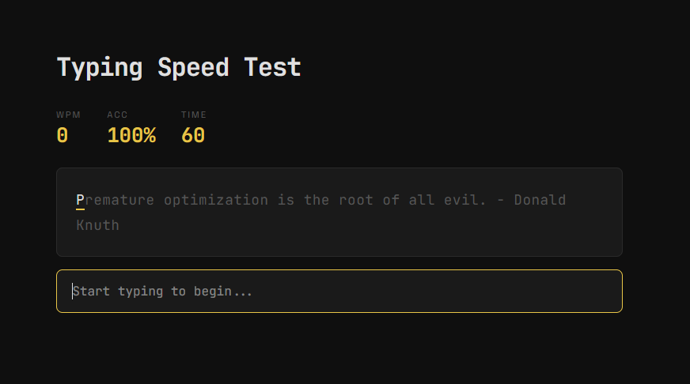

# Typing Speed Test

A browser-based typing speed test built with HTML, CSS and JavaScript.
Type as many programming quotes as you can in 60 seconds and check your Words Per Minute (WPM) and accuracy.

## Features
- 60 second countdown timer
- Live WPM tracking
- Accuracy tracking
- Character by character colour feedback
- Real programming quotes from famous developers
- Result screen with final WPM, accuracy, correct characters and errors
- Restart without refreshing the page

## Live Demo
[xtekkis.github.io/typing-speed-test](https://xtekkis.github.io/typing-speed-test)

## Preview

## Run Locally
1. Clone the repository
   git clone https://github.com/xtekkis/typing-speed-test.git
2. Open index.html in your browser